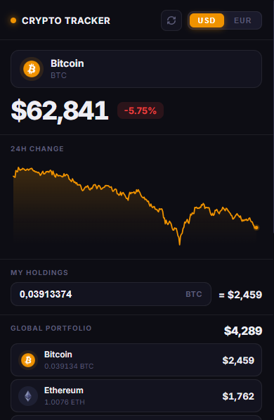

# Crypto Tracker

Extension Chrome pour suivre tes cryptos en temps réel depuis la barre d'outils.

  

---

## Ce que ça fait

- Prix en direct dans l'icône de l'extension (badge mis à jour automatiquement)
- Watchlist personnalisable — ajoute n'importe quelle crypto via la recherche CoinGecko
- Graphique 24h avec survol pour voir le prix à chaque point
- Suivi de portefeuille avec valeur totale calculée en temps réel
- Alertes prix (au-dessus / en-dessous d'un seuil) avec notification système
- Bascule USD / EUR instantanée

## Installation

> En attendant une éventuelle publication sur le Chrome Web Store.

1. Clone ou télécharge ce repo
2. Va sur `chrome://extensions`
3. Active le **mode développeur** (en haut à droite)
4. Clique sur **Charger l'extension non empaquetée** et sélectionne le dossier du projet

## Stack

- Manifest V3 (service worker background)
- [CoinGecko API](https://www.coingecko.com/en/api) — gratuit, sans clé API
- Vanilla JS / Canvas 2D — aucune dépendance
